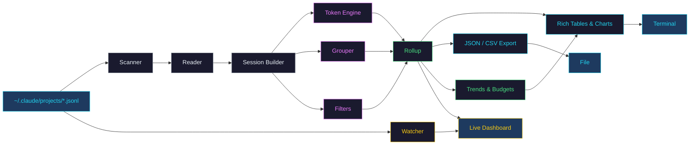
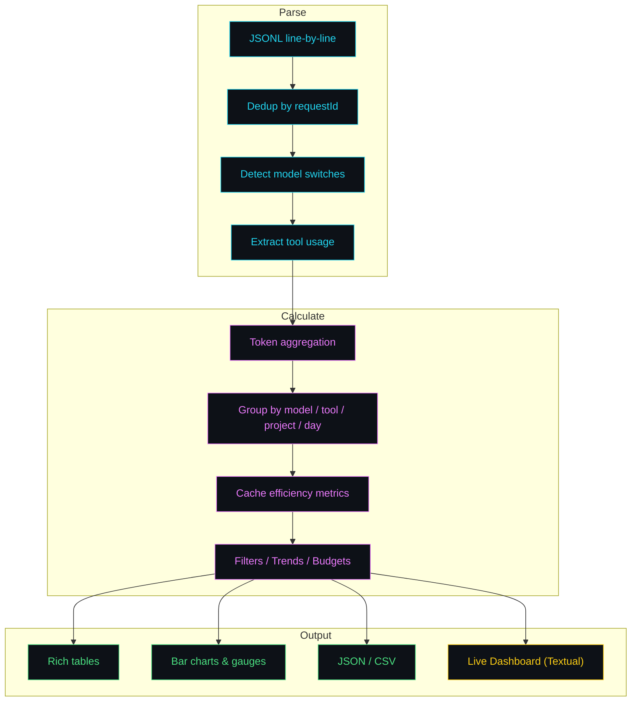
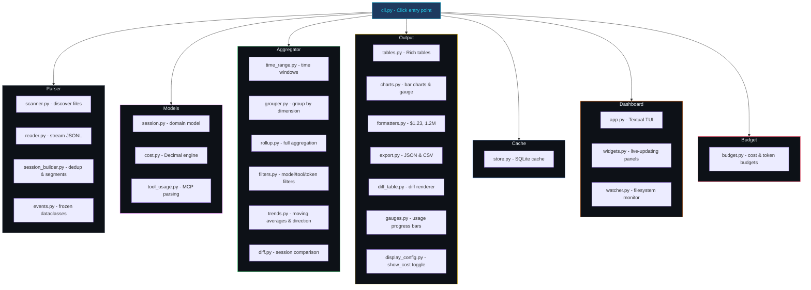

**Know where your Claude Code tokens go**

<a href="https://pypi.org/project/parsimony-cli/"></a>
<a href="https://pypi.org/project/parsimony-cli/"></a>
<a href="https://github.com/MinaSaad1/parsimony/blob/main/LICENSE"></a>
<a href="https://github.com/MinaSaad1/parsimony/actions"></a>

---

Claude Code subscribers have session and weekly token limits, not per-token charges. But there is no built-in way to see where those tokens went. **Parsimony gives you that visibility.** It reads the JSONL files Claude Code already saves on your machine and shows exactly which sessions, models, and tools consumed your usage allowance. No API keys needed.

**v0.3.0** reframes the entire tool around **token usage**. Cost is now opt-in via `--show-cost` for users who want API cost comparisons. New features: custom token budgets, token-based filtering, and visual usage gauges.

---

## Example Output

<div align="center">
  <picture>
    
  </picture>
</div>

---

## Install

```bash
pip install parsimony-cli
```

For the live dashboard:

```bash
pip install parsimony-cli[dashboard]
```

<details>
<summary>Other methods</summary>

```bash
pipx install parsimony-cli              # isolated install
pipx install parsimony-cli[dashboard]   # with live dashboard
uv tool install parsimony-cli           # with uv
python -m parsimony                     # if not in PATH
```

</details>

---

## Usage

```bash
parsimony                # today's token usage summary (default)
parsimony yesterday      # yesterday's report
parsimony week           # this week
parsimony week --last    # last week
parsimony month          # this month
parsimony month 2026-03  # specific month
```

All reports lead with token usage. To include API cost estimates, add `--show-cost`:

```bash
parsimony --show-cost week    # tokens + cost columns
```

### Token Budgets

Set custom session and weekly token limits in `~/.parsimony/config.yaml` to track your usage against your subscription allowance. Check your Claude Code usage page to see your actual limits and set these values accordingly:

```yaml
token_budget:
  session_limit: 500000         # max tokens per session
  weekly_limit: 5000000         # weekly token cap
```

When configured, reports show a usage gauge at the top:

```
Weekly:  [████████████████░░░░░░░░░░░░░░]  3.2M / 5.0M  (64.0%)
Session Peak:  [██████████████████████░░░░░░░░]  447.4K / 500.0K  (89.5%)
```

View budget status:

```bash
parsimony budget                  # view token + cost budget status
```

Color-coded progress bars show: green (<70%), yellow (70-90%), red (>90%).

### Filtering

Narrow any report by model, tool, or token usage:

```bash
parsimony week --model sonnet                    # only Sonnet sessions
parsimony today --model opus --model haiku        # Opus or Haiku
parsimony month --tool Read --tool Write          # sessions using Read or Write
parsimony week --min-tokens 50000                 # sessions using 50K+ tokens
parsimony top sessions --max-tokens 10000         # lightweight sessions only
parsimony week --model sonnet --min-tokens 10000  # combine filters
```

Cost-based filtering is also available when using `--show-cost`:

```bash
parsimony --show-cost week --min-cost 0.50       # sessions costing $0.50+
parsimony --show-cost top sessions --max-cost 1   # cheap sessions only
```

### Live Dashboard

Real-time terminal dashboard that auto-refreshes as Claude Code sessions generate new data. Requires the `dashboard` extras.

```bash
parsimony live                    # launch dashboard
parsimony live --project myapp    # filter by project
```

| Key | Action             |
| --- | ------------------ |
| `q` | Quit               |
| `r` | Force refresh      |
| `t` | Toggle today/week/month |

The dashboard shows: token usage summary with trend arrow, per-model token bars, top tools by call count, cache hit rate gauge, usage gauges (when token budgets are configured), and a scrollable session log sorted by token usage.

<div align="center">
  <picture>
    
  </picture>
</div>

### Cost Budgets

For API cost comparison, set dollar budgets in `~/.parsimony/config.yaml`:

```yaml
budget:
  daily: 5.00
  weekly: 25.00
  monthly: 80.00
```

Cost budget warnings appear when using `--show-cost`.

### Token Trends

Visualize token usage over time with daily bars, 7-day moving averages, and automatic trend direction detection:

```bash
parsimony trend              # 30-day token usage trend (default)
parsimony trend --days 7     # last 7 days
parsimony trend --days 90    # last 90 days
```

To see cost trends instead:

```bash
parsimony --show-cost trend --days 30
```

### Session Diff

Compare two sessions side-by-side to see how workflow changes affect token usage:

```bash
parsimony diff a1b2c3d4 e5f6a7b8    # compare by prefix or full UUID
```

Shows deltas for total tokens, input/output breakdown, cache efficiency, per-model breakdown, and per-tool usage with color-coded arrows. Add `--show-cost` to include cost comparison.

### Session Drill-Down

```bash
parsimony session a1b2c3d4   # prefix match or full UUID
```

### Rankings

```bash
parsimony top sessions --period week    # highest-token sessions
parsimony top models   --period month   # tokens by model
parsimony top tools    --period all     # most used tools
parsimony top projects --period week    # tokens by project
```

### Compare Periods

```bash
parsimony compare --period week  --last 4   # last 4 weeks side-by-side
parsimony compare --period month --last 3   # last 3 months
```

### Export

```bash
parsimony --export json month > report.json
parsimony --export csv week > models.csv
parsimony trend --days 7 --export json > trend.json
parsimony diff a1b2 c3d4 --export json > diff.json
```

JSON exports always include both token and cost data regardless of `--show-cost`.

---

## How It Works



### Data Pipeline



### What Each Report Shows

| Section       | Details                                         |
| ------------- | ----------------------------------------------- |
| **Summary**   | Total tokens (input/output/cache), session count |
| **By Model**  | Per-model tokens, share %, cost (with --show-cost) |
| **By Tool**   | Tool call counts, MCP vs built-in               |
| **Cache**     | Hit rate gauge, read/write breakdown             |
| **Sessions**  | Time, duration, project, model, tokens           |
| **Budgets**   | Token usage vs custom limits with progress bars  |
| **Trends**    | Daily token bars, 7-day moving average, direction |
| **Diff**      | Side-by-side session comparison with deltas      |
| **Dashboard** | All of the above, live-updating in real time     |

---

## Pricing (API Cost Comparison)

When using `--show-cost`, Parsimony estimates what your usage would cost via the Anthropic API. This is for comparison only and does not reflect your subscription charges.

Built-in pricing for all Claude models. Override at `~/.parsimony/pricing.yaml`:

<details>
<summary>Default pricing table</summary>

| Model      |   Input |   Output | Cache Write | Cache Read |
| ---------- | ------: | -------: | ----------: | ---------: |
| Opus 4.6   | $5.00/M | $25.00/M |     $6.25/M |    $0.50/M |
| Sonnet 4.6 | $3.00/M | $15.00/M |     $3.75/M |    $0.30/M |
| Haiku 4.5  | $1.00/M |  $5.00/M |     $1.25/M |    $0.10/M |

Unknown models fall back to Sonnet pricing.

</details>

---

## Project Structure



---

## Contributing

```bash
git clone https://github.com/MinaSaad1/parsimony.git
cd parsimony
pip install -e ".[dev,dashboard]"
pytest                # 325 tests, 80%+ coverage
ruff check src/       # lint
mypy src/             # type check
```

---

## License

MIT License. See [LICENSE](LICENSE) for details.
