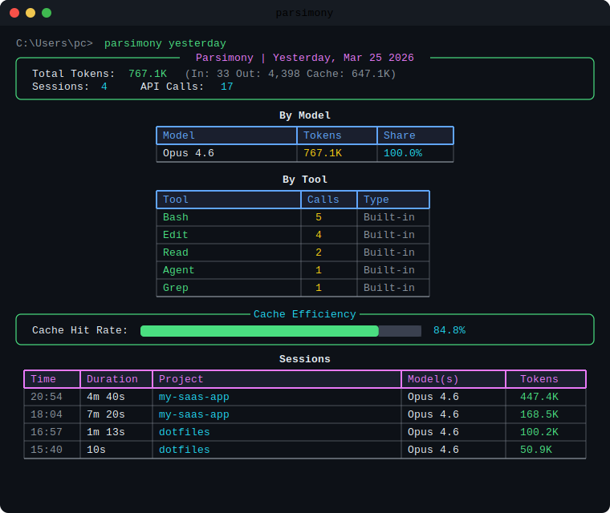
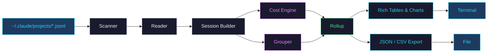
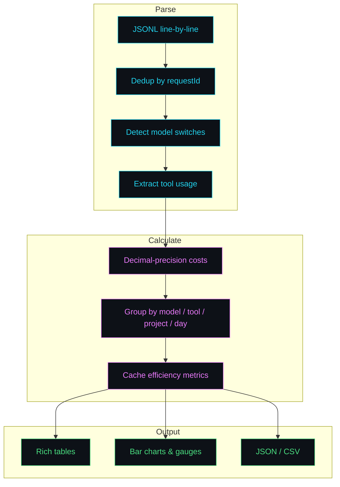
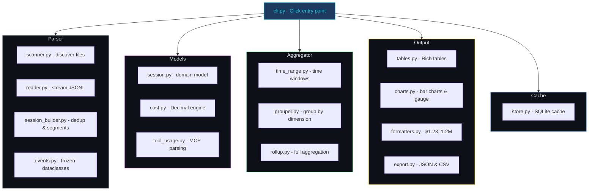

<div align="center">

```
 ██████╗  █████╗ ██████╗ ███████╗██╗███╗   ███╗ ██████╗ ███╗   ██╗██╗   ██╗
 ██╔══██╗██╔══██╗██╔══██╗██╔════╝██║████╗ ████║██╔═══██╗████╗  ██║╚██╗ ██╔╝
 ██████╔╝███████║██████╔╝███████╗██║██╔████╔██║██║   ██║██╔██╗ ██║ ╚████╔╝
 ██╔═══╝ ██╔══██║██╔══██╗╚════██║██║██║╚██╔╝██║██║   ██║██║╚██╗██║  ╚██╔╝
 ██║     ██║  ██║██║  ██║███████║██║██║ ╚═╝ ██║╚██████╔╝██║ ╚████║   ██║
 ╚═╝     ╚═╝  ╚═╝╚═╝  ╚═╝╚══════╝╚═╝╚═╝     ╚═╝ ╚═════╝ ╚═╝  ╚═══╝   ╚═╝
```

<strong>Token usage and cost observability for Claude Code</strong>

</div>

<p align="center">
  <a href="https://pypi.org/project/parsimony-cli/"></a>
  <a href="https://pypi.org/project/parsimony-cli/"></a>
  <a href="https://github.com/MinaSaad1/parsimony/blob/main/LICENSE"></a>
  <a href="https://github.com/MinaSaad1/parsimony/actions"></a>
</p>

---

You use Claude Code daily but have no idea which sessions cost the most, which tools burn tokens, or whether caching is helping. **Parsimony answers all of these.** No API keys needed. It reads the JSONL files Claude Code already saves on your machine.

---

## Example Output

<div align="center">
  <picture>
    
  </picture>
</div>

---

## Install

```bash
pip install parsimony-cli
```

<details>
<summary>Other methods</summary>

```bash
pipx install parsimony-cli     # isolated install
uv tool install parsimony-cli  # with uv
python -m parsimony            # if not in PATH
```

</details>

---

## Usage

```bash
parsimony                # today's summary (default)
parsimony yesterday      # yesterday's report
parsimony week           # this week
parsimony week --last    # last week
parsimony month          # this month
parsimony month 2026-03  # specific month
```

### Session Drill-Down

```bash
parsimony session a1b2c3d4   # prefix match or full UUID
```

### Rankings

```bash
parsimony top sessions --period week    # most expensive sessions
parsimony top models   --period month   # cost by model
parsimony top tools    --period all     # most used tools
parsimony top projects --period week    # cost by project
```

### Compare Periods

```bash
parsimony compare --period week  --last 4   # last 4 weeks side-by-side
parsimony compare --period month --last 3   # last 3 months
```

### Export

```bash
parsimony --export json month > report.json
parsimony --export csv week > models.csv
```

---

## How It Works



### Data Pipeline



### What Each Report Shows

| Section | Details |
|---------|---------|
| **Summary** | Total cost, session count, API calls |
| **By Model** | Per-model tokens, cost, share % |
| **By Tool** | Tool call counts, MCP vs built-in |
| **Cache** | Hit rate gauge, read/write breakdown |
| **Sessions** | Time, duration, project, model, cost |

---

## Pricing

Built-in pricing for all Claude models. Override at `~/.parsimony/pricing.yaml`:

<details>
<summary>Default pricing table</summary>

| Model | Input | Output | Cache Write | Cache Read |
|-------|------:|-------:|------------:|-----------:|
| Opus 4.6 | $5.00/M | $25.00/M | $6.25/M | $0.50/M |
| Sonnet 4.6 | $3.00/M | $15.00/M | $3.75/M | $0.30/M |
| Haiku 4.5 | $1.00/M | $5.00/M | $1.25/M | $0.10/M |

Unknown models fall back to Sonnet pricing.

</details>

---

## Project Structure



---

## Contributing

```bash
git clone https://github.com/MinaSaad1/parsimony.git
cd parsimony
pip install -e ".[dev]"
pytest                # 170 tests, 91%+ coverage
ruff check src/       # lint
mypy src/             # type check
```

---

## License

MIT License. See [LICENSE](LICENSE) for details.
